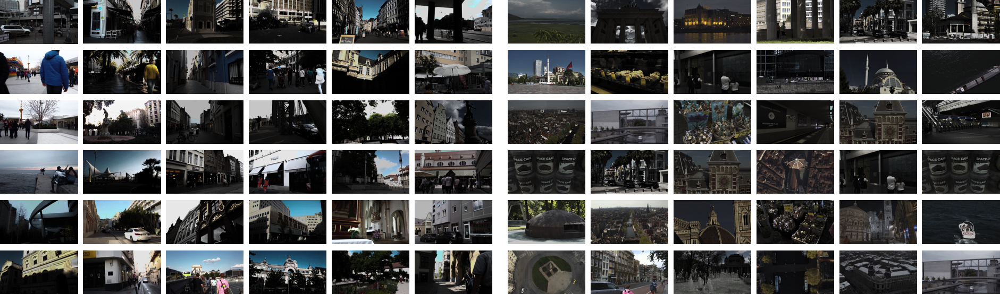
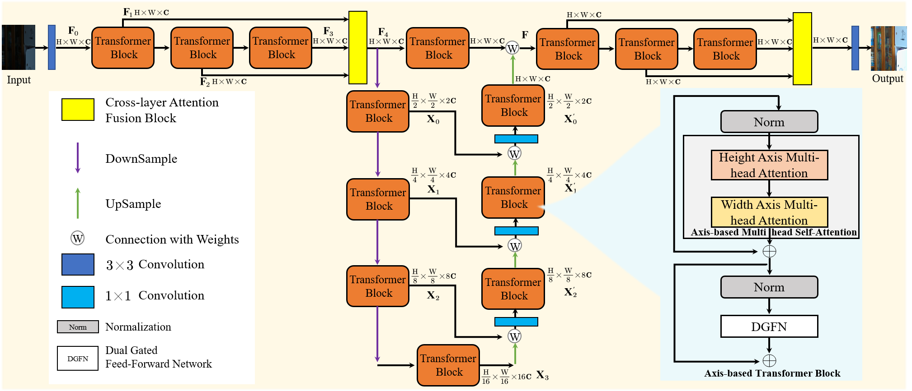
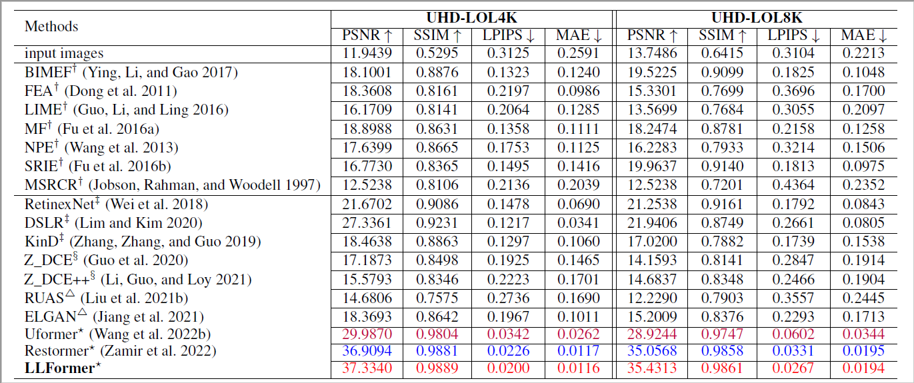
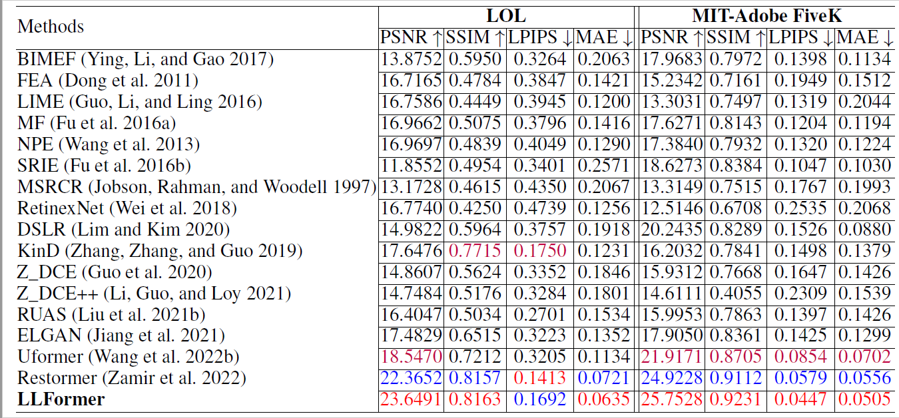

## Ultra-High-Definition Low-Light Image Enhancement: A Benchmark and Transformer-Based Method (AAAI 2023 -- Oral)


[Tao Wang](https://scholar.google.com/citations?user=TsDufoMAAAAJ&hl=en), [Kaihao Zhang](https://scholar.google.com/citations?user=eqwDXdMAAAAJ&hl=en), [Tianrun Shen](https://scholar.google.com/citations?hl=en&user=BKCgZL4AAAAJ), [Wenhan Luo](https://scholar.google.com/citations?user=g20Q12MAAAAJ&hl=en), [Bjorn Stenger](https://scholar.google.com/citations?user=plhjgHUAAAAJ&hl=en), [Tong Lu](https://cs.nju.edu.cn/lutong/index.htm)

[](https://arxiv.org/pdf/2212.11548.pdf)
[](https://arxiv.org/pdf/2212.11548.pdf)
[](https://arxiv.org/pdf/2212.11548.pdf)
[](https://arxiv.org/pdf/2212.11548.pdf)
[](https://arxiv.org/pdf/2212.11548.pdf)

>**Abstract:** As the quality of optical sensors improves, there is a need for processing large-scale images. In particular, the ability of devices to capture ultra-high definition (UHD) images and video places new demands on the image processing pipeline. 
>In this paper, we consider the task of low-light image enhancement (LLIE) and introduce a large-scale database consisting of images at 4K and 8K resolution. We conduct systematic benchmarking studies and provide a comparison of current LLIE 
>algorithms. As second contribution, we introduce LLFormer, a transformer-based low-light enhancement method. The core components of LLFormer are the axis-based multi-head self-attention and cross-layer attention fusion block, which significantly 
>reduces to linear complexity. Extensive experiments on the new dataset as well as on existing public datasets show that LLFormer outperforms state-of-the-art methods. We also show that employing existing LLIE methods trained on our benchmark as a 
>pre-processing step significantly improves the performance of downstream tasks, e.g., face detection in low-light conditions. The source code and pre-trained models are available at https://github.com/TaoWangzj/LLFormer. 


#### News
- **Jan 11, 2023:** Our paper is selected for an ORAL presentation at AAAI 2023
- **Dec 24, 2022:** Pre-trained models are released!
- **Dec 23, 2022:** Codes is released!
- **Dec 23, 2022:** Homepage is released!


This repository contains the dataset, code and pre-trained models for our paper. Please refer to our [project page](https://taowangzj.github.io/projects/LLFormer/) for a quick project overview.

## UHDLOL Benchmark for Image Enhancement


We create a new large-scale UHD-LLIE dataset called UHDLOL to benchmark the performance of existing LLIE methods and explore the UHD-LLIE problem. It consists of two subsets: UHD-LOL4K
and UHD-LOL8K. The UHD-LOL4K subset contains 8, 099 pairs of 4K low-light/normal-light images. Among them, 5,999 pairs of images are used for training and 2, 100 for testing. The UHD-LOL8K subset includes 2, 966 pairs of 8K low-light/normal-light images, which are split into 2, 029
pairs for training and 937 for testing. Please refer to to our [project page](https://taowangzj.github.io/projects/LLFormer/) for more detail. 
## Network Architecture


We propose a new transformer-based method for UHD-LLIE. The core design of LLFormer includes an axis-based transformer block and a cross-layer attention fusion block. In the former, axis-based multi-head self-attention performs self-attention on the height and width axis
across the channel dimension sequentially to reduce the computational complexity, and a dual gated feed-forward network employs a gated mechanism to focus more on useful features. The cross-layer attention fusion block learns the attention weights of features in different layers when fusing them.
## Quantitative results
### Results on UHD-LOL



### Results on LOL and MIT-Adobe FiveK



## Get Started
### Dependencies and Installation
1. Create Conda Environment 
```
conda create -n LLFormer python=3.7
conda activate LLFormer
conda install pytorch=1.8 torchvision=0.3 cudatoolkit=10.1 -c pytorch
pip install matplotlib scikit-image opencv-python yacs joblib natsort h5py tqdm
```
2. Clone Repo
```
git clone https://github.com/TaoWangzj/LLFormer.git
```

3. Install warmup scheduler

```
cd LLFormer
cd pytorch-gradual-warmup-lr; python setup.py install; cd ..
```

### Dataset
You can use the following links to download the datasets

1. UHD-LOL4K [[OneDrive](https://mailnwpueducn-my.sharepoint.com/:f:/g/personal/2018302756_mail_nwpu_edu_cn/EjqLBUb2ADxJhNIUpu-qFwABvbQcqboj9nIgOI4p-_0IZw) | [Baidu drive](https://pan.baidu.com/s/1APv_wBML734Wvb-Utpalig?pwd=s9bp)]
2. UHD-LOL8K [[OneDrive](https://mailnwpueducn-my.sharepoint.com/:f:/g/personal/2018302756_mail_nwpu_edu_cn/EhNBPOVCRAVLjQ_NarFmznkBAXw8m-ReCuYY92d3FtlW0Q?e=iIf9OS) | [Baidu drive](https://pan.baidu.com/s/1KdLg9sQoA8eeoFlg5p4pvQ?pwd=s6vf)]
3. LOL [[Link](https://daooshee.github.io/BMVC2018website/)]
4. MIT-Adobe FiveK [[Google drive](https://drive.google.com/drive/folders/1c33pXjeqX-Fwxc_yAozGQ0UlsSZ4IOqn?usp=drive_link) | [Baidu drive](https://pan.baidu.com/s/1z4sBVXdn8eJv1VpSI0LohA?pwd=yvhi)]

### Pretrained Model
We provide the pre-trained models under different datasets:
- LLFormer trained on UHD-LOL4K [[Google drive](https://drive.google.com/drive/folders/1v2AlYhr1S6cV1vvos5k-NFFHE9MRSdxh?usp=share_link) | [Baidu drive](https://pan.baidu.com/s/1COPloGYeVFdO2Z3-y1t-Xw?pwd=hpun)] with training config file `./configs/UHD-LOL4K/train/training_UHD_4K.yaml`.

- LLFormer trained on UHD-LOL8K [[Google drive](https://drive.google.com/drive/folders/1O9MHWAo8gyxhxqTVoCmFxJXcKhWjYzeE?usp=share_link) | [Baidu drive](https://pan.baidu.com/s/1R7AbnS9wweA52RCKPWRh7w?pwd=iv81)] with training config file `./configs/UHD-LOL8K/train/training_UHD_8K.yaml`.

- LLFormer trained on LOL [[Google drive](https://drive.google.com/drive/folders/1J7NvvPsCtT0j8Rd9ombJ6sVIC6v0Xweb?usp=share_link) | [Baidu drive](https://pan.baidu.com/s/18QBMVHWGfvnlMKF-g0go9Q?pwd=41ty)] with training config file `./configs/LOL/train/training_LOL.yaml`
- LLFormer trained on MIT-Adobe FiveK [[Google drive](https://drive.google.com/drive/folders/1CmZC2drX2t3H9U4zq4DvOlsP03J7AYXy?usp=share_link) | [Baidu drive](https://pan.baidu.com/s/1qBru615T0OoThGMJzs2giQ?pwd=gkhu)] with training config file `./configs/MIT-Adobe-FiveK/train/training_MIT_5K.yaml`.

### Visual comparison results 
We provide the visual results of all existing methods in Table 2 on LOL and MIT-Adobe FiveK datasets
- Visual results on LOL dataset [[OneDrive](https://mailnwpueducn-my.sharepoint.com/:f:/g/personal/2018302756_mail_nwpu_edu_cn/ErK1fyhDJshKrLefzsJ92-IBUBk_hUCJORj7bcupJG6zIg?e=hTrWuP) | [Baidu drive](https://pan.baidu.com/s/1NjdWo1j33mxTJV7rLe1zPA?pwd=awbm)].
- Visual results on MIT-Adobe FiveK dataset [[OneDrive](https://mailnwpueducn-my.sharepoint.com/:f:/g/personal/2018302756_mail_nwpu_edu_cn/EkJoZREY-dRCp36UrzOqtPMBoU5d3wM5ka1NLZ7N-12a-g?e=BBgQtX) | [Baidu drive](https://pan.baidu.com/s/1BkDHPwTml1IB5ZVbiPMoRw?pwd=o54t)].


### Test
You can directly test the pre-trained model as follows

1. Modify the paths to dataset and pre-trained mode. 
```python
# Tesing parameter 
input_dir # the path of data
result_dir # the save path of results 
weights # the weight path of the pre-trained model
```

2. Test the models for LOL and MIT-Adobe FiveK dataset

You need to specify the data path ```input_dir```, ```result_dir```, and model path ```weight_path```. Then run
```bash
python test.py --input_dir your_data_path --result_dir your_save_path --weights weight_path

```

3. Test the models for UHD-LOL dataset

You need to specify the data path ```input_dir```, ```result_dir```, and model path ```weight_path```. Then run
```bash
python test_UHD.py --input_dir your_data_path --result_dir your_save_path --weights weight_path

```
(Due to GPU memory limitation, we suggest the users to test with patch-based mode for UHD images)

### Train

1. To download UHD-LOL training and testing data


2. Generate image patches from full-resolution training images of UHD-LOL dataset

```
python scripts/extract_subimages_UHD.py
```

3. To train LLFormer, run
```bash
python train.py -yml_path your_config_path
```
```
You need to modify the config for your own training environment
```


## Citations
If UHDLOL benchmark and LLFormer help your research or work, please consider citing:

```
@inproceedings{wang2023ultra,
  title={Ultra-high-definition low-light image enhancement: A benchmark and transformer-based method},
  author={Wang, Tao and Zhang, Kaihao and Shen, Tianrun and Luo, Wenhan and Stenger, Bjorn and Lu, Tong},
  booktitle={Proceedings of the AAAI Conference on Artificial Intelligence},
  volume={37},
  number={3},
  pages={2654--2662},
  year={2023}
}
 @inproceedings{zhang2021benchmarking,
      title={Benchmarking ultra-high-definition image super-resolution},
      author={Zhang, Kaihao and Li, Dongxu and Luo, Wenhan and Ren, Wenqi and Stenger, Bjorn and Liu, Wei and Li, Hongdong and Yang, Ming-Hsuan},
      booktitle={ICCV},
      pages={14769--14778},
      year={2021}
    }
```


## Contact

If you have any questions, please contact taowangzj@gmail.com

---


## Our Related Works
- Benchmarking Ultra-High-Definition Image Super-resolution, ICCV 2021. [Paper](https://openaccess.thecvf.com/content/ICCV2021/papers/Zhang_Benchmarking_Ultra-High-Definition_Image_Super-Resolution_ICCV_2021_paper.pdf) | [Code](https://github.com/HDCVLab/UHD4K_UHD8K)
- MC-Blur: A Comprehensive Benchmark for Image Deblurring, arXiv 2022. [Paper](https://arxiv.org/pdf/2112.00234.pdf) | [Code](https://github.com/HDCVLab/MC-Blur-Dataset)

---

## Reference Repositories
This implementation is based on / inspired by:
- HWMNet: https://github.com/FanChiMao/HWMNet
- Restormer: https://github.com/swz30/Restormer
- LLFlow: https://github.com/wyf0912/LLFlow
- BasicSR: https://github.com/XPixelGroup/BasicSR

---

<details>
<summary>statistics</summary>


</details>


