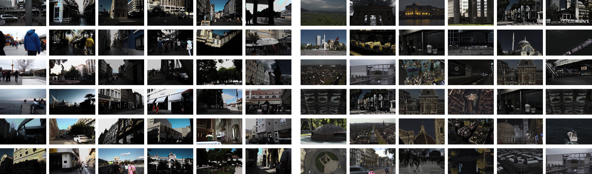
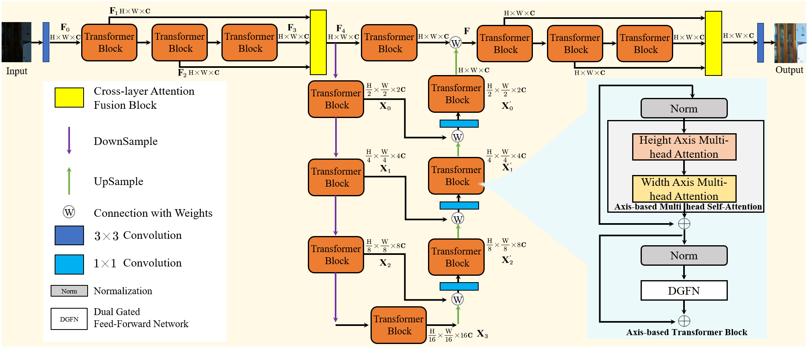

## Ultra-High-Definition Low-Light Image Enhancement: A Benchmark and Transformer-Based Method


[Tao Wang](https://scholar.google.com/citations?user=TsDufoMAAAAJ&hl=en), [Kaihao Zhang](https://scholar.google.com/citations?user=eqwDXdMAAAAJ&hl=en), [Tianrun Shen](https://tiruns.github.io/), [Wenhan Luo](https://scholar.google.com/citations?user=g20Q12MAAAAJ&hl=en), [Bjorn Stenger](https://scholar.google.com/citations?user=plhjgHUAAAAJ&hl=en), [Tong Lu](https://cs.nju.edu.cn/lutong/index.htm)

[](https://arxiv.org/pdf/2212.11548.pdf)
[](https://arxiv.org/pdf/2212.11548.pdf)
[](https://arxiv.org/pdf/2212.11548.pdf)
[](https://arxiv.org/pdf/2212.11548.pdf)
[](https://arxiv.org/pdf/2212.11548.pdf)

>**Abstract:** As the quality of optical sensors improves, there is a need for processing large-scale images. In particular, the ability of devices to capture ultra-high definition (UHD) images and video places new demands on the image processing pipeline. 
>In this paper, we consider the task of low-light image enhancement (LLIE) and introduce a large-scale database consisting of images at 4K and 8K resolution. We conduct systematic benchmarking studies and provide a comparison of current LLIE 
>algorithms. As second contribution, we introduce LLFormer, a transformer-based low-light enhancement method. The core components of LLFormer are the axis-based multi-head self-attention and cross-layer attention fusion block, which significantly 
>reduces to linear complexity. Extensive experiments on the new dataset as well as on existing public datasets show that LLFormer outperforms state-of-the-art methods. We also show that employing existing LLIE methods trained on our benchmark as a 
>pre-processing step significantly improves the performance of downstream tasks, e.g., face detection in low-light conditions. The source code and pre-trained models are available at https://github.com/TaoWangzj/LLFormer. 


#### News
- **Dec 23, 2022:** homepage is released!
- **Dec 23, 2022:** codes are coming soon!


This repository contains the code and pre-trained models for our paper. Please refer to our [project page](https://taowangzj.github.io/projects/LLFormer/) for a quick project overview.

## UHDLOL Benchmark for Image Enhancement

## Network Architecture



## Installation
The model is built in PyTorch 1.8.1 and tested on Ubuntu 16.04 environment (Python3.7.5, CUDA10.1).

For installing, follow these intructions
```
conda create -n LLFormer python=3.7
conda activate LLFormer
conda install pytorch=1.8 torchvision=0.3 cudatoolkit=10.1 -c pytorch
pip install matplotlib scikit-image opencv-python yacs joblib natsort h5py tqdm
```

Install warmup scheduler

```
git clone https://github.com/TaoWangzj/LLFormer-main.git
cd LLFormer-main
cd pytorch-gradual-warmup-lr; python setup.py install; cd ..
```


### Results

| name | Dataset|PSNR|SSIM|LPIPS|MAE|
|:----|:----|:----|:----|:----|:----|
|LLFormer|LOL|23.6491|0.8163|0.1692|0.0635|
|LLFormer|MIT-Adobe FiveK|25.7528|0.9231|0.0447|0.0505|
|LLFormer|UHD-LOL4K|37.3340|0.9889|0.0200|0.0116|
|LLFormer|UHD-LOL8K|35.4313|0.9861|0.0267|0.0194|


### Citations
If UHDLOL benchmark and LLFormer help your research or work, please consider citing:

```
    @inproceedings{Wang2022LLFormer
        title={Ultra-High-Definition Low-Light Image Enhancement: A Benchmark and Transformer-Based Method}, 
        author={Tao Wang, Kaihao Zhang, Tianrun Shen, Wenhan Luo, Bjorn Stenger, Tong Lu},
        booktitle={AAAI},
        year={2023}
    }
    
    @inproceedings{zhang2021benchmarking,
      title={Benchmarking ultra-high-definition image super-resolution},
      author={Zhang, Kaihao and Li, Dongxu and Luo, Wenhan and Ren, Wenqi and Stenger, Bjorn and Liu, Wei and Li, Hongdong and Yang, Ming-Hsuan},
      booktitle={ICCV},
      pages={14769--14778},
      year={2021}
    }
```


### Contact

If you have any questions, please contact taowangzj@gmail.com

---


## Our Related Works
- Benchmarking Ultra-High-Definition Image Super-resolution, ICCV 2021. [Paper](https://openaccess.thecvf.com/content/ICCV2021/papers/Zhang_Benchmarking_Ultra-High-Definition_Image_Super-Resolution_ICCV_2021_paper.pdf) | [Code](https://github.com/HDCVLab/UHD4K_UHD8K)
- MC-Blur: A Comprehensive Benchmark for Image Deblurring, arXiv 2022. [Paper](https://arxiv.org/abs/2102.02808) | [Code](https://github.com/HDCVLab/MC-Blur-Dataset)


